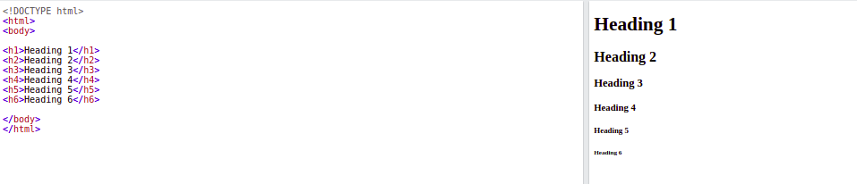
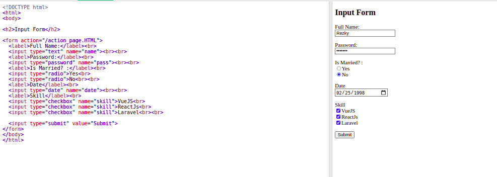
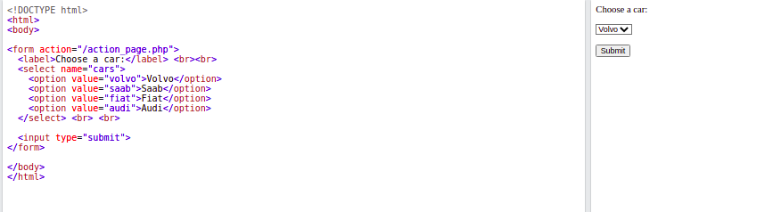
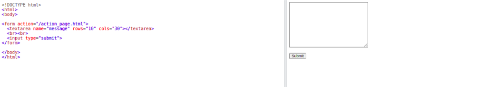

# Berkenalan dengan HTML

## ***Apa itu HTML ??***

<p align="justify">HTML merupakan singkatan dari Hyper Text Markup Language. HTML adalah sebuah bahasa standar untuk pembuatan halaman web. Dengan adanya HTML, kita dapat membedakan struktur yang tersusun dari sebuah halaman melalui tag atau elemen-elemen penyusunnya.</p>
<p align="justify">Elemen atau tag pada HTML dikenali oleh browser seperti google chrome, firefox atau Ms Edge, dll. Browser tersebut mengidentifikasi setiap elemen penyusun HTML dan ditampilkan sesuai karakteristik elemen tersebut. Contohnya sebuah elemen paragraph akan ditampilkan sebagai tulisan panjang, atau sebuah elemen pranala/link akan dicetak dengan warna biru dan ketika mouse mendekat kursornya berubah menjadi telunjuk, dsb.</p>

<p align="justify">Contoh sebuah halaman HTML sederhana:</p>

```html
  <!DOCTYPE html>
  <html>
  <head>
  <title>Page Title</title>
  </head>
  <body>

  <h1>My First Heading</h1>
  <p>My first paragraph.</p>

  </body>
  </html>
```
<p align="justify">Dari contoh di atas kita dapat mengidentifikasi elemen-elemen nya seperti berikut:</p>

* element  ```<!DOCTYPE html>``` mengartikan bahwa dokumen ditulis dengan versi HTML5
* elemen ```<html>``` adalah elemen induk atau elemen utama yang sering disebut juga root element dari sebuah halaman HTML.
* elemen ```<head>``` berisi informasi tentang halaman HTML yang sedang dibuat
* elemen ```<title>``` adalah judul dari halaman HTML yang akan tampil di tab browser.

## ***Elemen pada HTML***
<p align="justify">Elemen atau sering disebut dengan tag pada HTML adalah penyusun dari sebuah halaman web yang dapat dikenali oleh browser dan ditampilkan oleh browser sesuai karakteristik masing-masing.</p>

<p align="justify">Sebuah elemen HTML terdiri dari tag pembuka(start/open tag), atribut (attribute), isi (content), dan tag penutup(close tag).</p>


pada ilustrasi di atas merupakan sebuah elemen paragraph dibuka dengan tag pembuka ```<p>``` . Di dalam tag pembuka tersebut terdapat atribut class yang disematkan ke dalam tag. Isi atau content dari sebuah tag paragraph ```<p>``` akan ditampilkan sebagai paragraf. lalu terakhir sebuah tag ditutup dengan sebuah tag penutup.

*catatan*
Tidak semua elemen HTML memiliki tag penutup seperti ```<input>  <meta>```.

## ***Elemen di dalam elemen (nested element)***
<p align="justify">sebuah elemen HTML dapat terisi dengan elemen-elemen lain di dalamnya. Semua dokumen HTML yang kita lihat di halaman web terdiri dari kumpulan elemen bersarang atau elemen yang mengandung elemen lain di dalamnya.</p>

Contohnya halaman berikut:
```html
<!DOCTYPE html>
<html>
<body>

<h1>My First Heading</h1>
<p>My first paragraph.</p>

</body>
</html>
```
Pada contoh di atas elemen ```<html>``` adalah root element dan merupakan elemen utama di dokument HTML. elemen tersebut dibuka dengan tag pembuka ```<html>``` dan ditutup dengan ```</html>```. Lalu di dalam elemen ```<html>``` terdapat elemen ```<body>```. elemen ```<body>``` merupakan elemen yang akan ditampilkan ke halaman web yang diawali dengan tag pembuka ```<body>``` dan ditutup dengan sebuah tag penutup ```</body>```, dan seterusnya sehingga terciptalah sebuah halaman web yang utuh.

***Heading HTML***
Heading Pada HTML berfungsi untuk membuat judul atau subtitle pada tampilan website


***List HTML***
Terdapat 2 jenis list di HTML yaitu Unordered dan Ordered


***HTML Input Types***
Beberapa Input type yang bisa di gunakan di HTML:
```html
<input type="button">
<input type="checkbox">
<input type="color">
<input type="date">
<input type="datetime-local">
<input type="email">
<input type="file">
<input type="hidden">
<input type="image">
<input type="month">
<input type="number">
<input type="password">
<input type="radio">
<input type="range">
<input type="reset">
<input type="search">
<input type="submit">
<input type="tel">
<input type="text">
<input type="time">
<input type="url">
<input type="week">
```

***Input Form HTML***


***Dropdown***
Berfungsi untuk menampilkan dropdown list kedalam tampilan website


***Textarea***
Berfungsi Membuat inputan yang jauh lebih lebar


attribute cols untuk lebar nilai kolom dari inputan dan attribute rows untuk besar nilai baris dari inputan

**Referensi Video**
* Belajar HTML dari Dasar oleh Sekolah Koding: https://youtube.com/playlist?list=PLCZlgfAG0GXC9ojTmU95BRefbJoi4clY-
* HTML Dasar dari Web Programming UNPAS : https://youtube.com/playlist?list=PLFIM0718LjIVuONHysfOK0ZtiqUWvrx4F

**sumber**
tulisan ini disarikan dari halaman dokumentasi W3schools : https://www.w3schools.com/html/default.asp

